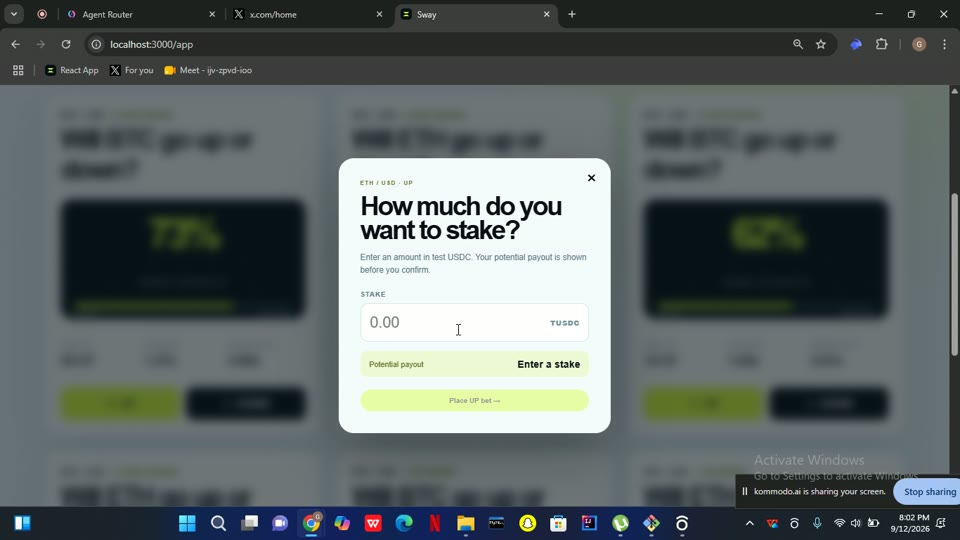

# Sway


**Tap the crowd.** Sway is a consumer prediction app built on **Somnia × DreamDEX Event Contracts**. It turns short-term crypto market predictions into a simple, fast experience: choose a live BTC or ETH round, tap **UP** or **DOWN**, enter with a fixed amount, and watch the market move.

> Sway bridges the gap between complex leveraged crypto trading and rigid prediction pools. It lets users make simple short-term BTC/ETH predictions with capped risk, a payout fixed at entry, and the ability to cash out before the market resolves. By combining DreamDEX's order-book Event Contracts with Somnia's fast settlement, Sway makes on-chain prediction simpler, faster, and more accessible.

The key idea is simple. Your payout is determined by the **live DreamDEX order book at the moment you enter**, rather than changing later as more people participate. That gives every position a clear entry price and removes the dilution that can happen in traditional parimutuel prediction systems.

Sway runs on the **Somnia Shannon testnet** using test funds only.

## Product Demo

[](./public/sway-demo-neural.mp4)

[Watch or download the full demo video](./public/sway-demo-neural.mp4)

## How Sway Works

Each market is a time-limited round for an asset such as BTC/USD or ETH/USD. A round has two possible outcomes:

* **UP** is the YES outcome token.
* **DOWN** is the NO outcome token.

When a user enters a round, Sway submits an **immediate-or-cancel (IOC) taker order** against the live DreamDEX order book. The order consumes available liquidity immediately, while any unfilled remainder is cancelled. This means the position's payout is determined by the actual fill price at entry.

Once a position is open, Sway tracks the market in real time.

While the round is still running, users can see the current estimated value of their position and can attempt to **cash out before resolution** by selling their outcome tokens back into the order book. Sway calculates the available exit value from actual resting bids rather than displaying a theoretical price. When there is insufficient liquidity to exit, the interface makes that clear instead of pretending a trade can be executed.

When the round ends, DreamDEX resolves the market on-chain. Winning positions can then redeem their collateral, and voided markets return the appropriate collateral.

## What Makes Sway Different

Sway is built around three ideas that set the experience apart from a basic prediction pool.

### 1. Your payout is locked at entry

The order book determines the price when you enter. Later participants do not dilute your position or change the payout you locked in.

### 2. You can exit early

Users do not have to wait until a round finishes. They can sell their position back into the market while the round is live, either partially or completely, depending on available liquidity.

### 3. The crowd becomes part of the experience

Sway visualizes the market's implied probability over the life of a round through **"Sway the Line."** The chart shows how the order-book price changes over time, giving users a live view of how market sentiment is shifting.

Together with the leaderboard and shareable result pages, this turns a prediction into something users can follow, compete over, and share.

## The User Journey

**Discover → Predict → Watch → Cash Out or Resolve → Redeem → Compete**

Users first browse available BTC and ETH rounds, with different durations running at the same time.

They select a direction and amount, confirm the transaction through their wallet, and receive a position whose payout is based on the actual entry fill.

During the round, they can monitor time remaining, their current position value, and the movement of the crowd's implied probability.

They can then either:

* **Cash out early** by selling into available order-book liquidity, or
* **Hold until resolution** and redeem the winning position after the market settles.

Completed outcomes contribute to the leaderboard, creating a simple competitive layer around wins, streaks, and PnL.

## Why DreamDEX Event Contracts

DreamDEX provides the market primitive that makes Sway possible.

Sway does not simulate its markets or maintain a separate prediction engine. It integrates with the official **`@somnia-chain/markets-sdk`** and works with real Event Contract markets, real order-book liquidity, real fills, and on-chain settlement.

This matters because two of Sway's defining features, entry-priced payouts and early cash-out, depend on an actual order book. A parimutuel pool would not provide the same mechanics.

## Why Somnia

Sway is designed around short-duration markets where responsiveness matters.

Somnia's high-performance execution environment makes the rapid interaction between market discovery, entry, live monitoring, and settlement practical for a consumer-facing application. The project is currently deployed on the Somnia Shannon testnet environment, using chain ID `50312`.

The combination of Somnia's performance and DreamDEX's order-book Event Contracts gives Sway the infrastructure needed for short, live prediction rounds rather than forcing users into long-duration positions.

## Technical Architecture

Sway is built with:

* **Next.js 14 / App Router**
* **React**
* **TypeScript**
* **wagmi v2**
* **viem v2**
* **`@somnia-chain/markets-sdk`**
* **TanStack React Query**
* **Somnia Shannon testnet**

The application separates the interface from the blockchain integration. Chain-facing operations are wrapped in typed modules inside `lib/somnia`, and the interface communicates through these abstractions and the application's API routes.

At a high level, a single tap flows from the interface, through the typed wrappers, and out to DreamDEX on Somnia:

```
                  You · phone browser
                          │
                     tap UP / DOWN
                          ▼
            ┌──────────────────────────┐
            │    Next.js UI (client)   │
            └──────────────────────────┘
              │                      │
           Path A                 Path B
        wallet signs           POST /api/bet
        (viem, in browser)     (server dev key)
              │                      │
              ▼                      ▼
            ┌──────────────────────────┐
            │    lib/somnia wrappers   │
            └──────────────────────────┘
                          │
                          ▼
               @somnia-chain/markets-sdk
                          │
                          ▼
           DreamDEX Event Contracts on Somnia
              Shannon testnet · chain 50312
```

```
app/
  api/**            server routes: rounds, bet, cashout, position, leaderboard, result, share, series
  (ui)/**           the phone-first interface (client)
lib/
  types.ts          the shared contract: every shape the UI and API exchange
  db.ts             file-backed JSON leaderboard store (no native deps)
  somnia/
    config.ts       public, client-safe constants: chain, addresses, URLs, fee config
    client.ts       server-only exchange (holds PRIVATE_KEY), never imported by the browser
    browser.ts      client-safe: binds the visitor's wallet (viem WalletClient) to sign as them
    markets.ts      discover live markets (scans MarketCreated logs) and tradability checks
    rounds.ts       round framing (NEXT / LIVE / EXPIRED), payouts, the "Sway the Line" series
    trade.ts        placeBet, positionValue, sellPosition, redeemWinnings
    crowd.ts        crowd-meter math (pure)
    stream.ts       poll-based live updates for a market
scripts/            discover, smoke (read-only checks), trade-live (needs a funded key)
```

Market discovery is also **indexer-independent**. Instead of relying entirely on an external indexing service, Sway scans the chain for `MarketCreated` events and derives the currently available rounds from Somnia itself.

Every position can be signed in two ways, and both call the same `lib/somnia` functions. The preferred path uses the visitor's own wallet, which signs in the browser. A server-key fallback is also available through `POST /api/bet` and `/api/cashout` for a quick demo without a wallet.

## Non-Custodial by Design

Sway does not take custody of user funds.

The preferred transaction flow uses the connected user's own wallet through wagmi/viem. The user signs the transaction in the browser, and Sway never receives or stores the user's private key.

Settlement is handled by DreamDEX's Event Contract infrastructure. Sway does not introduce a separate contract to hold user collateral or determine winners. Instead, it reads the market state and uses the DreamDEX SDK for actions such as redemption.

## Handling Real-World Liquidity Constraints

One of the engineering challenges Sway addresses is the reality of thin testnet order books.

A prediction interface should never show users an exit price that cannot actually be filled. Sway therefore calculates cash-out estimates by walking the available bids on the user's held side of the market.

When there are no suitable bids, Sway reports that an exit is currently unavailable rather than displaying a misleading number.

This keeps the interface honest about the actual state of the market instead of hiding liquidity limits behind a simulated quote.

## Security

Security is built around a strict separation between public client code and server-only functionality.

No private key is included in the browser bundle. Server-only exchange functionality is isolated from client modules, and wallet signing is performed through the user's connected wallet. Orders are also checked against the live on-chain market state before submission rather than relying solely on local timestamps.

## Additional Features

Sway also includes:

* Live market-implied probability
* Position tracking and cash-out valuation
* Winning-position redemption
* Leaderboards based on wins, streaks, and PnL
* Shareable user outcome pages
* A market-belief history chart
* Support for multiple market durations running simultaneously


### Scripts

| Command | What it does | Needs a funded key? |
|---|---|---|
| `npm run dev` | Run the app locally | reads no, positions yes |
| `npm run build` | Production build (also type-checks) | no |
| `npm run typecheck` | Run `tsc --noEmit` across the whole project | no |
| `npm run discover` | List the live rounds through the real core | no |
| `npm run smoke` | Read-only end-to-end check: discovery, rounds, crowd, leaderboard | no |
| `npm run trade:live` | Place a real testnet position from start to finish | yes |

Both the app and the helper scripts read `.env.local` from the repo root, so one root file holding your `PRIVATE_KEY` covers everything. The scripts also fall back to a local `_template/.env` if one exists, without overriding anything you have already set.

## The Market Fee (Dormant by Default)

Sway can take a small cut on each entry, routed on-chain through the protocol's native builder-fee rail to a treasury address. It is a transparent, consented fee rather than a hidden rake, and it stays off until you set a treasury address, so the demo runs fee-free out of the box.

```bash
# Turn on a 1% entry fee to a treasury you control:
NEXT_PUBLIC_SWAY_BUILDER_ADDRESS=0xYourTreasury
NEXT_PUBLIC_SWAY_BUILDER_FEE_BPS_TIMES_1K=100000   # 100000 = 100 bps = 1%
NEXT_PUBLIC_SWAY_BUILDER_FEE_ENABLED=true
```

When it is on, the fee is clamped to the pool's frozen ceiling, the wallet approves the builder once per pool, and a winning `BetResult` carries `feeRate` and `fee` for honest on-screen disclosure. Exits are never charged.

## What We Built for the Hackathon

The core Sway infrastructure already covers market discovery, round framing, live market data, betting, cash-out, redemption, probability history, leaderboard data, and wallet signing paths. The repository also includes scripts for discovery, read-only smoke testing, and live testnet trading.

The project is currently a **testnet hackathon prototype**. The trading core works end-to-end on testnet and is being hardened, and the remaining work is focused on completing and refining the full consumer-facing interface around it.

## Future Direction

The next stage for Sway is to make the experience more social and scalable:

* More supported assets and round durations
* Shared positions and head-to-head predictions
* Streak sharing and social profiles
* Better liquidity incentives for two-sided books
* A richer market discovery experience
* Mainnet deployment when the underlying Event Contract infrastructure is production-ready

The goal is to make on-chain prediction feel less like interacting with a financial primitive and more like joining a live, shared experience with everyone else.

**One round. One decision. Watch the crowd sway.**

## Built On

[Somnia](https://somnia.network) Shannon testnet · DreamDEX Event Contracts · [`@somnia-chain/markets-sdk`](https://www.npmjs.com/package/@somnia-chain/markets-sdk) · Next.js · viem / wagmi · RainbowKit.
